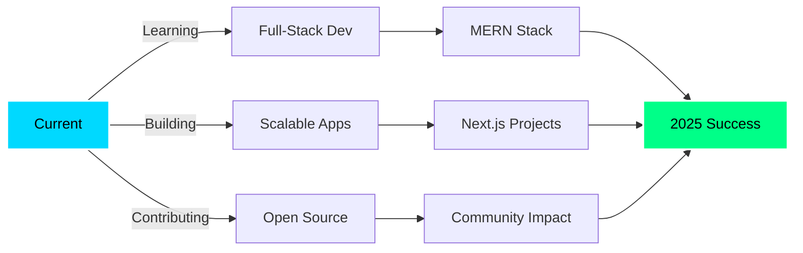

<div align="center">
  
  <!-- Animated Header Banner -->
  
  
  <!-- Typing Animation -->
  <a href="https://git.io/typing-svg">
    
  </a>
  
  <!-- Profile Views & Social Badges -->
  <p align="center">
    
    
    
  </p>
  
</div>

<br/>

<!-- About Section with Image -->


##  About Me

```javascript
const faisal = {
    title: "Frontend Developer",
    location: "Pakistan 🇵🇰",
    code: ["JavaScript", "TypeScript", "React", "Next.js"],
    currentFocus: "Building scalable web applications",
    learning: ["MERN Stack", "Advanced Next.js"],
    askMeAbout: ["Frontend", "React", "Tailwind CSS", "Web Performance"],
    funFact: "I turn coffee into code ☕ → 💻",
    availableForHire: true
};
```

<br clear="right"/>

---

## 🎯 Current Status

<table>
  <tr>
    <td>
      
    </td>
    <td>
      
🔭 Working on **Innovative Web Projects**

🌱 Learning **Next.js & Full-Stack Development**

💡 Open to **Collaborations & Freelance**

📫 Reach me: **bodlah05@gmail.com**

⚡ Fun fact: **Code, Debug, Coffee, Repeat!**
      
  </td>
  </tr>
</table>

---

## 🚀 Tech Stack & Tools

<div align="center">

### 💻 Languages & Frontend
<p>
  
  
  
  
</p>

### ⚛️ Frameworks & Libraries
<p>
  
  
  
  
  
</p>

### 🛠️ Tools & Platforms
<p>
  
  
  
  
  
</p>

</div>

---

## 📊 GitHub Statistics

<div align="center">
  
  
</div>

<div align="center">
  
  
</div>

<div align="center">
  
</div>

---

## 🏆 Achievements & Trophies

<div align="center">
  
</div>

---

## 🎯 2025 Goals & Vision

<div align="center">



</div>

<table align="center">
  <tr>
    <td align="center" width="50%">
      <b>🎓 Learning</b><br/>
      ✅ Master MERN Stack<br/>
      ✅ Advanced Next.js Patterns<br/>
      ✅ Performance Optimization
    </td>
    <td align="center" width="50%">
      <b>🚀 Building</b><br/>
      ✅ Production-Ready Apps<br/>
      ✅ Open Source Contributions<br/>
      ✅ Personal Portfolio Projects
    </td>
  </tr>
</table>

---

## 🌐 Connect With Me

<div align="center">
  
[](https://www.linkedin.com/in/faisal-khalil-769525254/)
[](mailto:bodlah05@gmail.com)
[](https://github.com/Faisalkhalil86)
[](#)

</div>

---

## 💼 Latest Projects

<div align="center">
  
[](https://github.com/Faisalkhalil86)
[](https://github.com/Faisalkhalil86)

</div>

---

<div align="center">
  
### 💭 Random Dev Quote
  


### 😂 Random Dev Meme


</div>

---

<div align="center">
  
  <!-- Snake Animation -->
  <picture>
    <source media="(prefers-color-scheme: dark)" srcset="https://raw.githubusercontent.com/Faisalkhalil86/Faisalkhalil86/output/github-contribution-grid-snake-dark.svg">
    <source media="(prefers-color-scheme: light)" srcset="https://raw.githubusercontent.com/Faisalkhalil86/Faisalkhalil86/output/github-contribution-grid-snake.svg">
    
  </picture>

  <!-- Footer Wave -->
  
  
  ### ⭐ From [Faisal Khalil](https://github.com/Faisalkhalil86) with 💙
  
  <i>⚡ "Building the web, one component at a time" ⚡</i>
  
</div>
